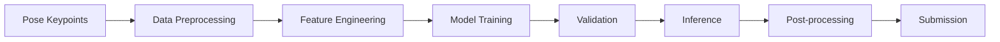

# MABe Mouse Behavior Recognition — Silver Medal Solution

This repository contains a silver medal solution for the Kaggle MABe Challenge: Social Action Recognition in Mice.

The task is to recognize social and non-social behaviors of mice from pose keypoint sequences extracted from top-view videos. Instead of using raw video frames, this project focuses on structured pose data, including body keypoint coordinates, relative distances, movement speed, acceleration, and interactions between mice.

The solution combines feature engineering, tree-based machine learning models, and post-processing strategies to improve behavior recognition performance. The main challenges include cross-lab generalization, imbalanced behavior categories, inconsistent body keypoints, and temporal smoothing of frame-level predictions.

This project is mainly organized as a competition solution summary and reproducible code repository, including training notebooks, inference notebooks, and a technical write-up.
---

## 1. Project Overview

MABe Challenge 是一个面向多智能体动物行为识别的比赛，目标是利用机器学习方法自动识别小鼠复杂行为，例如攻击、防御、理毛、筑巢、抚养幼崽、照顾同伴等。

传统动物行为分析通常依赖人工观察和手动标注，不仅耗时，而且容易受到主观因素影响。本比赛希望通过机器学习方法推动动物行为分析自动化，为神经科学、计算生物学、动物行为学和生态学等研究提供技术支持。

---

## 2. Task Description

比赛聚焦于小鼠社会行为识别。参赛者需要基于俯视视频中提取的小鼠姿态估计数据，构建模型识别多种社交与非社交行为。

输入数据主要包括：

- 小鼠身体关键点坐标；
- 视频帧序列；
- 小鼠个体信息；
- 实验室来源信息；
- 行为标注信息。

模型需要根据连续帧中的姿态变化和小鼠之间的互动关系，预测对应的行为类别。

---

## 3. Evaluation Metric

比赛采用加权 F-Score 作为评价指标。

该指标会先在单个实验室内部进行平均，再按照视频和行为层级进行汇总，从而避免某些实验室或高频动作对最终结果产生过大影响。

这也意味着模型不仅需要在训练数据上表现良好，还需要具备较强的跨实验室泛化能力。

---

## 4. Main Challenges

本任务的主要难点包括：

1. **跨实验室数据差异明显**  
   不同实验室的拍摄环境、设备配置、关键点定义和标注习惯可能不同，模型容易学到实验室特有的偏差。

2. **行为类别不均衡**  
   某些行为出现频率较高，而攻击、防御、理毛等行为可能较为稀有，模型容易偏向高频类别。

3. **姿态关键点不完全一致**  
   不同数据源中记录的身体部位可能不同，需要进行关键点对齐或构造更加稳定的相对特征。

4. **行为具有时间连续性**  
   小鼠行为不是单帧分类问题，而是连续时间序列识别问题，需要考虑动作开始、持续和结束的过程。

5. **后处理影响较大**  
   行为预测结果通常需要经过阈值搜索、概率平滑和冲突处理，才能得到更稳定的最终结果。

---

## 5. Technical Routes

本比赛主要形成了两类技术路线：基于特征工程和树模型的方案，以及基于神经网络的时序建模方案。

### 5.1 Feature Engineering + Tree Models

第一类方案主要依赖人工设计特征，并使用 XGBoost、LightGBM、CatBoost 等模型进行训练。

常用特征包括：

- 身体关键点之间的距离；
- 身体关键点之间的角度；
- 小鼠运动速度；
- 小鼠运动加速度；
- 主体小鼠与目标小鼠之间的跨体距离；
- 以小鼠自身为中心的 ego-centric 坐标；
- 实验室 ID、帧率等元信息。

这类方法的优点是训练速度较快、可解释性较强，并且适合处理结构化特征。缺点是对特征工程依赖较大，需要人工设计大量有效特征。

### 5.2 Neural Network Models

第二类方案使用 LSTM、GRU、CNN-Transformer、Transformer 等模型，对连续姿态序列进行建模。

常用策略包括：

- 使用滑动窗口输入连续帧；
- 使用 CNN 提取局部时间模式；
- 使用 RNN 或 Transformer 捕捉长期依赖；
- 对每个动作采用 one-vs-rest 方式训练；
- 对非法动作进行 mask；
- 使用数据增强提升模型泛化能力。

神经网络方案更适合捕捉复杂的时序模式，但训练成本更高，对数据处理、验证策略和后处理要求也更高。

---

## 6. High-scoring Solution Summary

高分方案普遍围绕一个核心问题展开：如何让模型在不同实验室、不同设备配置和不同标注习惯的数据中保持稳定泛化。

一些高分队伍采用了 solo 行为和 pair 行为分别建模的策略，将所有输入统一为固定帧率，并构造距离、速度、加速度和跨体距离等动态特征。模型结构通常包括多尺度卷积、GRU、Transformer 或 SqueezeFormer。

也有方案将 LSTM 与 XGBoost 进行融合：一方面用神经网络捕捉时序信息，另一方面用树模型处理手工特征，最后对多个模型的预测结果进行加权融合。

此外，部分方案强调构建对实验室差异不敏感的特征表示，例如使用以主体小鼠为中心的坐标系统，对坐标进行平移、旋转和缩放，或者直接使用身体部位之间的相对距离来替代绝对坐标。

在后处理阶段，高分方案通常不会简单使用最大概率作为最终预测，而是结合按“实验室 × 动作”搜索得到的阈值、概率平滑、Z 分数决策和多动作冲突处理来提升最终分数。

---

## 7. Project Structure

```text
MABe-Mouse-Behavior-Recognition
├── README.md
├── requirements.txt
├── .gitignore
├── notebooks
│   ├── 01_train_model.ipynb
│   └── 02_inference_submission.ipynb
└── docs
    └── MABe_Challenge_Summary.pdf
```

---

## 8. File Description

| File | Description |
|---|---|
| `notebooks/01_train_model.ipynb` | 模型训练代码，包含数据读取、特征构造、模型训练和验证流程 |
| `notebooks/02_inference_submission.ipynb` | 推理代码，用于生成测试集预测结果和提交文件 |
| `docs/MABe_Challenge_Summary.pdf` | 比赛背景、技术路线和高分方案总结 |
| `requirements.txt` | 项目运行所需 Python 依赖 |
| `.gitignore` | Git 忽略规则，用于避免上传数据集、缓存文件和本地输出文件 |

---

## 9. Workflow



---

## 10. How to Run

Install dependencies:

```bash
pip install -r requirements.txt
```

Run the training notebook:

```bash
jupyter notebook notebooks/01_train_model.ipynb
```

Run the inference notebook:

```bash
jupyter notebook notebooks/02_inference_submission.ipynb
```

---

## 11. Data Notice

由于 Kaggle 比赛数据较大，且可能存在使用限制，本仓库不直接上传完整原始数据。

需要运行代码时，请先从 Kaggle 官方比赛页面下载数据，并根据 notebook 中的数据路径进行放置。

本仓库主要用于展示代码结构、建模思路和比赛复盘，不作为完整数据集存储仓库。

---

## 12. Project Highlights

本项目的主要亮点包括：

- 基于小鼠姿态关键点序列进行行为识别；
- 涉及计算机视觉、姿态估计、时序建模和数据挖掘；
- 整理了训练代码、推理代码和比赛复盘文档；
- 总结了 XGBoost、LightGBM、CatBoost、LSTM、GRU、Transformer 等常见方案；
- 关注跨实验室泛化、类别不均衡、阈值搜索和时序后处理问题；
- 适合作为 Kaggle 比赛复盘和个人 GitHub 项目展示。

---

## 13. Future Work

后续可以继续改进以下方向：

- 将 notebook 中的核心函数拆分为 Python 脚本；
- 增加姿态轨迹可视化；
- 增加特征重要性分析；
- 增加不同模型的实验对比；
- 尝试神经网络与树模型集成；
- 优化阈值搜索和概率平滑策略；
- 补充更完整的本地验证流程。

---

## 14. Keywords

Kaggle, MABe Challenge, Mouse Behavior Recognition, Computer Vision, Pose Estimation, Time-Series Modeling, XGBoost, LightGBM, CatBoost, LSTM, GRU, Transformer